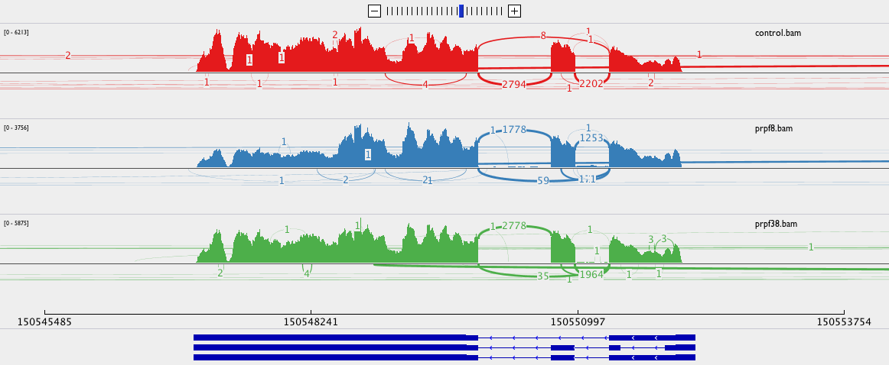
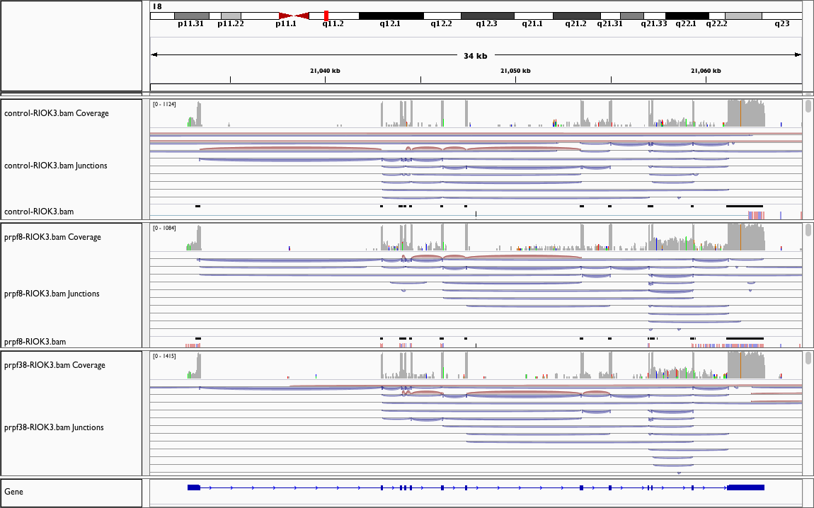

---
output:
  html_document:
    toc: true
    toc_float: true
    code_folding: show
    highlight: zenburn
    theme: flatly
---

```{r setup, echo=FALSE}


knitr::opts_chunk$set(tidy=TRUE, highlight=TRUE, dev="png",
                      cache=TRUE, cache.lazy=FALSE, highlight=TRUE, autodep=TRUE,
                      warning=FALSE, error=FALSE,
                      message=FALSE, prompt=TRUE, comment='', fig.cap='')
```

# Transcript level differential expression with Sleuth
Sleuth is one of a new class of tools for doing differential expression.
The papers that Fabio linked to us mostly looked at inclusion-exclusion
events by looking at reads passing over splice junctions. This type of
approach throws away a lot of information.

There is some ambiguity when trying to assign an alignment to a
particular transcript which introduces technical variation.
The idea behind sleuth is to try to separate out the technical variation
from the biological variation by bootstrap sampling to estimate the technical
variation and removing it from the overall variation.

```{r sleuth-setup}
library(dplyr)
library(sleuth)
load("counts.RData")
sample_dirs = file.path("..", "..", rownames(summarydata))
sf_dirs = file.path(sample_dirs, "sailfish", "quant")
names(sf_dirs) = rownames(summarydata)
sfdata = summarydata[, "genotype", drop=FALSE]
sfdata$sample = rownames(sfdata)
sfdata$path = sf_dirs
design = ~genotype
```

```{r sleuth-prep}
mart <- biomaRt::useMart(biomart = "ensembl", dataset = "hsapiens_gene_ensembl")
t2g <- biomaRt::getBM(attributes = c("ensembl_transcript_id", "ensembl_gene_id",
    "external_gene_name", "gene_biotype", "transcript_biotype"), mart = mart)
t2g <- dplyr::rename(t2g, target_id = ensembl_transcript_id,
  ens_gene = ensembl_gene_id, ext_gene = external_gene_name)
so = sleuth_prep(sfdata, design, target_mapping=t2g) %>% sleuth_fit()
so = sleuth_wt(so, 'genotypeprpf8')
so = sleuth_wt(so, 'genotypeprpf38')
prpf8_tab = sleuth_results(so, 'genotypeprpf8', show_all=TRUE)
prpf38_tab = sleuth_results(so, 'genotypeprpf38', show_all=TRUE)
```

We considered `r nrow(prpf8_tab)` transcripts in total.
We find `r nrow(subset(prpf8_tab, qval < 0.05))` transcripts differentially
expressed in `PRPF8` and `r nrow(subset(prpf38_tab, qval < 0.05))` transcripts
differentially expressed in `PRPF38`.

## MCL1
MCL1 has three isoforms `r subset(prpf8_tab, ext_gene == "MCL1")$target_id`.
Here we plot the boxplots of the bootstrap estimates for the counts for each
transcript, colored by genotype of the samples.

```{r MCL-boxplot}
df = get_bootstraps(so, "ENST00000464132")
df = rbind(df, get_bootstraps(so, "ENST00000369026"))
df = rbind(df, get_bootstraps(so, "ENST00000307940"))
ggplot(df, aes(sample, est_counts+1, fill=genotype)) +
  geom_boxplot() +
  facet_wrap(~target_id, ncol=1) +
  theme_bw() +
  scale_y_log10() +
  theme(axis.text.x = element_text(angle = 90, hjust = 1)) +
  ylab("estimated counts") +
  xlab("")
```

It looks like we can see the splice difference in `PRPF8` compared
to `control` here. Specifically, an upregulation of `ENST00000307940`
and `ENST00000464132`. All three transcripts are significantly different
from `control` in both the `PRPF8` and `PRPF38` samples.

Below we can see that `ENST00000369026` which is down in `PRPF8` and `PRPF38`
is the longest isoform-- the other two transcripts are missing the 3' UTR of
the transcript. There is some evidence then that loss of `PRPF8` and `PRPF38`
leads to the loss of the 3' UTR of `MCL1`.

```{r MCL-model}
library("Gviz")
library("GenomicRanges")
library("biomaRt")
library("BiocGenerics")
bmt = BiomartGeneRegionTrack(genome="hg19", symbol="MCL1")
plotTracks(bmt, transcriptAnnotation="transcript")
```

Looking at the alignments for MCL1, we can see that there is a drop in the 3'
UTR for PRPF8.



The 5'-3' bias, a measure of degradation, doesn't look much different between
the samples, so that doesn't explain the difference.

```{r 5primebias}
library(ggplot2)
ggplot(summarydata, aes(Name, X5.3.bias, fill=genotype)) +
  geom_bar(stat='identity', position='dodge') + theme_bw() +
  ylab("5'-3' bias") + xlab("") +
  theme(axis.text.x = element_text(angle = 90, hjust = 1))
```

```{r MCL1-subsets}
mcl1 = subset(prpf8_tab, ext_gene == "MCL1")
mcl1_considered = mcl1[complete.cases(mcl1),]$target_id
mcl1_prpf8 = subset(prpf8_tab, ext_gene == "MCL1" & qval < 0.05 &
                               complete.cases(prpf8_tab))
mcl1_prpf38 = subset(prpf38_tab, ext_gene == "MCL1" & qval < 0.05 &
                               complete.cases(prpf38_tab))
```

### PRPF8 compared to control
```{r MCL1-PRPF8}
knitr::kable(mcl1_prpf8)
```

### PRPF38 compared to control
```{r MCL1-PRPF38}
knitr::kable(mcl1_prpf38)
```

## PRPF38
PRPF38 is knocked down but not out.

```{r PRPF38-boxplot}
prpf38_considered = subset(prpf8_tab, ext_gene == "PRPF38A")$target_id
df = Map(function(x) {get_bootstraps(so, x)}, prpf38_considered)
df = do.call(rbind, df)
ggplot(df, aes(sample, est_counts+1, fill=genotype)) +
  geom_boxplot() +
  facet_wrap(~target_id, ncol=1) +
  theme_bw() +
  scale_y_log10() +
  theme(axis.text.x = element_text(angle = 90, hjust = 1)) +
  ylab("estimated counts") +
  xlab("")
```

## PRPF8
The PRPF8 knockout seems less complete, there are only two isoforms that
are knocked down in the PRPF8 samples:

```{r PRPF8-boxplot}
prpf8_considered = subset(prpf8_tab, ext_gene == "PRPF8" & !is.na(pval))$target_id
df = Map(function(x) {get_bootstraps(so, x)}, prpf8_considered)
df = do.call(rbind, df)
ggplot(df, aes(sample, est_counts+1, fill=genotype)) +
  geom_boxplot() +
  facet_wrap(~target_id, ncol=1) +
  theme_bw() +
  scale_y_log10() +
  theme(axis.text.x = element_text(angle = 90, hjust = 1)) +
  ylab("estimated counts") +
  xlab("")
```

## RIOK3
There are many more isoforms for RIOK3:

```{r RIOK-3-model}
bmt = BiomartGeneRegionTrack(genome="hg19", symbol="RIOK3")
plotTracks(bmt, transcriptAnnotation="transcript")
riok3 = subset(prpf8_tab, ext_gene == "RIOK3")
riok3_considered = riok3[complete.cases(riok3),]$target_id
riok3_prpf8 = subset(prpf8_tab, ext_gene == "RIOK3" & qval < 0.05 &
                               complete.cases(prpf8_tab))
riok3_prpf38 = subset(prpf38_tab, ext_gene == "RIOK3" & qval < 0.05 &
                               complete.cases(prpf38_tab))
```

But of the `r nrow(riok3)`
RIOK3 transcripts we looked at, we only had evidence for
`r riok3_considered`.

### PRPF8 compared to control
```{r RIOK3-prpf8}
knitr::kable(riok3_prpf8)
```

### PRPF38 compared to control
```{r RIOK3-prpf38}
knitr::kable(riok3_prpf38)
```

While significant, the q-value isn't super small. This is reflected if
you eyeball boxplots of the bootstrap estimates:

```{r RIOK3-boxplot}
df = Map(function(x) {get_bootstraps(so, x)}, riok3_considered)
df = do.call(rbind, df)
ggplot(df, aes(sample, est_counts+1, fill=genotype)) +
  geom_boxplot() +
  facet_wrap(~target_id, ncol=1) +
  theme_bw() +
  scale_y_log10() +
  theme(axis.text.x = element_text(angle = 90, hjust = 1)) +
  ylab("estimated counts") +
  xlab("")
```

If we look at the alignments and log the counts, we can see that there might
be a retained intron towards the 3' end of the transcript:



But it isn't the predominant isoform, it goes from 5 -> 20 counts or so if we
mouse over the alignments. So there is some evidence that there is a retained
intron event there if we visually inspect the alignments.

There is a pseudogene for RIOK3, RIOK3P1 but we don't assign enough reads to
affect the quantitation.

# Full tables of results
We'll add an indicator to the tables that says whether or not a gene has
reciprocal splicing changes before writing them out.

```{r write-results}
prpf8_tab = prpf8_tab %>% na.omit() %>% group_by(ens_gene) %>%
  mutate(reciprocal=(sum(b > 0 & qval < 0.05) > 0) & sum(b < 0 & qval < 0.05) > 0 & length(ens_gene) > 1) %>% as.data.frame()
prpf38_tab = prpf38_tab %>% na.omit() %>% group_by(ens_gene) %>%
  mutate(reciprocal=(sum(b > 0 & qval < 0.05) > 0) & sum(b < 0 & qval < 0.05) > 0 & length(ens_gene) > 1) %>% as.data.frame()
write.table(prpf8_tab, file="control-vs-prpf8-sleuth.csv", quote=FALSE,
            row.names=FALSE, col.names=TRUE, sep=",")
write.table(prpf38_tab, file="control-vs-prpf38-sleuth.csv", quote=FALSE,
            row.names=FALSE, col.names=TRUE, sep=",")
```

[control-vs-prpf8](control-vs-prpf8-sleuth.csv)

[control-vs-prpf38](control-vs-prpf38-sleuth.csv)


# Write TPM matrix

```{r tpm-matrix}
tpm = so$obs_norm %>%
  dplyr::select(target_id, sample, tpm) %>%
  tidyr::spread(sample, tpm)
library(biomaRt)
library(dplyr)
human = useMart(biomart = "ENSEMBL_MART_ENSEMBL",
                dataset="hsapiens_gene_ensembl",
                host = "jul2015.archive.ensembl.org")
symbols = getBM(attributes=c("ensembl_transcript_id", "external_gene_name",
                             "gene_biotype", "transcript_biotype"), mart=human)
tpm = tpm %>% left_join(symbols, by=c("target_id"="ensembl_transcript_id"))
write.table(tpm, file="tpm.csv", quote=FALSE, col.names=TRUE, row.names=FALSE,
            sep=",")
```

[TPM matrix](tpm.csv)

# Transcript MA plots

```{r sleuth-ma-plot}
library(cowplot)
sleuth_MA = function(results) {
  results$DE = results$qval < 0.05
  ggplot(results, aes(mean_obs, b, color=DE)) +
    geom_point(size=0.5) +
    guides(color=FALSE) +
    scale_color_manual(values=c("black", "red")) +
    xlab("mean expression") +
    ylab(expression("\u0392")) +
    scale_x_log10()
}
```

## PRPF8
```{r prpf8-ma-plot}
sleuth_MA(prpf8_tab)
```

## PRPF38
```{r prpf38-plot}
sleuth_MA(prpf38_tab)
```
